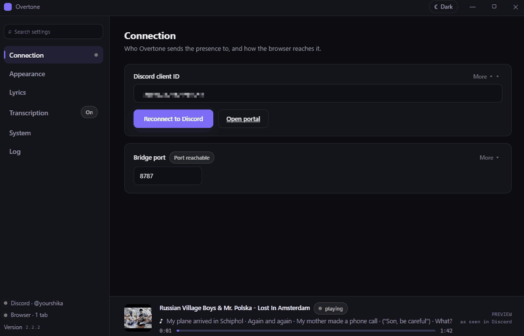
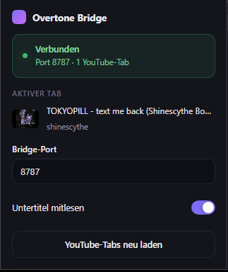

# Overtone

**Zeig auf deinem Discord-Profil, was du gerade auf YouTube hörst.**

  

  <a href="../../releases/latest"><b>⬇ Für Windows herunterladen</b></a> &nbsp;·&nbsp;
  <a href="#einrichten">Einrichten</a> &nbsp;·&nbsp;
  <a href="#geht-was-nicht">Hilfe</a> &nbsp;·&nbsp;
  <a href="README.md">English</a>

---

## Was es macht

Deine Freunde sehen den Song — nicht bloß „schaut YouTube".

- 🎵 **Der Song in der Überschrift** — `Hört doli, szevczor - 162020 zu`, statt immer nur „YouTube"
- 🖼️ **Das Cover** — das Video-Vorschaubild, bei YouTube Music das Albumcover
- ⏱️ **Ein echter Fortschrittsbalken** — mit Restzeit, folgt Pausen und Sprüngen
- 🎤 **Die Lyrics, Zeile für Zeile** — laufen mit dem Song mit, wahlweise als Absatz
- ▶️ **Ein kleines Symbol** — läuft, pausiert, Wiederholung oder Live
- 🔗 **Ein Knopf zum Video** — ein Klick, und sie hören mit
- 🔒 **Diskret-Modus** — zeigt, dass du etwas schaust, ohne zu verraten was

---

## Ein Blick hinein

Zu jeder Option steht in normalem Deutsch, was sie tut. Der Streifen unten ist eine mitlaufende Vorschau dessen, was gerade auf deinem Profil steht — keine Attrappe. Und wenn etwas klemmt, steht im Protokoll, was das Programm gerade macht.

---

## Einrichten

Etwa fünf Minuten, einmalig.

### 1 · Programm installieren

Bei den [Releases](../../releases/latest) herunterladen und starten.

Windows warnt, dass es das Programm nicht kennt. Das liegt daran, dass die Datei
kein gekauftes Zertifikat hat — nicht daran, dass etwas damit nicht stimmt.
**Weitere Informationen → Trotzdem ausführen.**

Danach sitzt Overtone still unten rechts neben der Uhr.

### 2 · Discord-ID holen

Discord will wissen, wer da fragt, bevor es etwas anzeigt.

1. Im [Discord Developer Portal](https://discord.com/developers/applications) anmelden
2. **New Application**, irgendeinen Namen eingeben, zustimmen, **Create**
3. Die **Application ID** kopieren
4. In Overtones Einstellungen einfügen (die gehen beim ersten Start von selbst auf)

Das ist der einzige umständliche Schritt, und du machst ihn genau einmal.

### 3 · In den Browser einbauen

1. `brave://extensions` oder `chrome://extensions` öffnen
2. Oben rechts den **Entwicklermodus** einschalten
3. **Entpackte Erweiterung laden** und den Ordner `extension` auswählen
4. Offene YouTube-Tabs einmal neu laden

Ein Klick auf das Symbol der Erweiterung zeigt, ob die Brücke steht und welcher Tab gelesen wird. Steht dort, die App sei nicht erreichbar, läuft sie nicht oder die Ports stimmen nicht überein.

### 4 · Eine Einstellung in Discord

**Einstellungen → Aktivitätsdatenschutz → „Aktivitätsstatus anzeigen"** muss an
sein. Normalerweise ist es das schon.

Spiel etwas ab. Nach ein paar Sekunden steht es an deinem Profil.

---

## Zu den Lyrics

Overtone schaut an drei Stellen nach, in dieser Reihenfolge:

**1. Eine Lyrics-Datenbank.** [LRCLIB](https://lrclib.net) ist kostenlos und
kennt die meiste bekannte Musik, samt passendem Timing.

**2. YouTubes eigene Untertitel.** Bei vielen Musikvideos ist der Songtext als
Untertitelspur hinterlegt. Das rettet Songs, die keine Datenbank kennt — die
Untertitel müssen aber **im Player eingeschaltet** sein, sonst gibt es nichts
zu lesen.

**3. Dein PC hört selbst hin.** Optional und standardmäßig aus. Overtone kann
sich den Song anhören und den Text selbst schreiben. Das dauert einige Minuten
und lastet den Prozessor aus, hilft also nie dem gerade laufenden Song — aber
der Text wird gespeichert und ist beim nächsten Mal sofort da.

Alles Gefundene liegt als kleine Textdatei auf deinem PC. Denselben Song noch
mal gehört, und die Lyrics sind ohne Wartezeit da. Stimmt das Timing nicht ganz,
kannst du die Datei öffnen und korrigieren — und **Overtone überschreibt nie,
was du selbst bearbeitet hast**.

---

## Gut zu wissen

- **Das Cover ist nicht anklickbar.** Das erlaubt Discord keiner App — nur
  Knöpfe dürfen Links sein. Deshalb der Knopf darunter.
- **Die Lyrics dürfen etwas hinterherhinken.** Discord lässt nur alle paar
  Sekunden eine Aktualisierung zu, ein schneller Rap-Track ist also nie ganz
  exakt im Takt. Overtone legt seine Aktualisierungen so gut, wie das Limit es
  zulässt.
- **Dein Custom-Status bleibt deiner.** Overtone fasst den Statustext an deinem
  Profil nicht an. Den automatisch zu ändern hieße, quasi dein Kontopasswort
  aus der Hand zu geben — also lässt Overtone die Finger davon.
- **Vorerst nur Windows.**

---

## Geht was nicht?

**Bei Discord erscheint nichts**
Läuft die Discord-**App**? Über die Browser-Version geht das nicht. Danach in
Overtones Einstellungen schauen — dort steht, ob Discord und Browser verbunden sind.

**Da steht „YouTube" statt des Songs**
Dein Browser hat noch die alte Fassung der Erweiterung. In `brave://extensions`
bei Overtone auf ↻ klicken und die YouTube-Tabs neu laden.

**Keine Lyrics**
Manche Songs stehen in keiner Datenbank. Probier, im YouTube-Player die
Untertitel einzuschalten — die kann Overtone lesen.

**Freunde sehen den Knopf nicht**
Discord blendet Knöpfe manchmal aus, wenn man sein *eigenes* Profil ansieht.
Frag jemand anderen, was er sieht.

Immer noch hängen? [Melde es hier](../../issues) — schreib dazu, was du erwartet
hast und was stattdessen passiert ist.

---

## Lizenz

**Nutzung kostenlos, Verkauf und Weiterverbreitung nicht.** Privat wie beruflich, auf so vielen
eigenen Geräten wie du magst, und für dich selbst auch änderbar. Nicht verkaufen, und nicht
anderswo hochladen als in dieses Repository — verlinke stattdessen hierher.

Der volle Text steht in [`LICENSE`](LICENSE); die Bausteine, auf denen Overtone aufsetzt, behalten
ihre eigenen Lizenzen, aufgelistet in [`THIRD-PARTY-NOTICES.md`](THIRD-PARTY-NOTICES.md).

Weder mit Discord noch mit YouTube oder Google verbunden. 
Selber bauen oder schrauben? In [`docs/`](docs/) stehen alle Einstellungen und wie es innen funktioniert.
