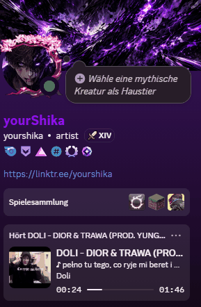

# Overtone

**Discord Rich Presence for YouTube — with the song, the cover and the lyrics.**

[Setup](#setup) · [How it works](#how-it-works) · [Lyrics](#lyrics) · [Troubleshooting](#troubleshooting) · [Deutsch](README.de.md)

---

## What it does

Your friends see the song, not just "watching YouTube".

|  | |
|---|---|
| 🎵 **The song in the header** | `Listening to doli, szevczor - 162020`, instead of the same "YouTube" for everything |
| 🖼️ **Cover art** | The video thumbnail, or the album art on YouTube Music |
| ⏱️ **A real progress bar** | With time remaining, following pauses and skips |
| 🎤 **Lyrics, line by line** | Moving along with the song, or as paragraphs |
| ▶️ **A state badge** | Playing, paused, on repeat, or live |
| 🔗 **A button to the video** | One click and they're watching it too |
| 🔒 **Privacy mode** | Show that you're watching something, without saying what |

---

## Setup

About five minutes, once.

### 1 · Install the app

Download from the [latest release](../../releases/latest) and run it. No other software is needed — the app brings everything it uses.

Windows will warn that it doesn't recognise the program. That is because the file carries no paid signing certificate, not because anything is wrong with it: **More info → Run anyway.**

Overtone then sits in your system tray, next to the clock.

### 2 · Create a Discord application

Discord identifies apps by an ID before it shows anything.

1. Open the [Discord Developer Portal](https://discord.com/developers/applications) and sign in
2. **New Application** → give it any name → **Create**
3. Copy the **Application ID**
4. Paste it into Overtone's settings window, which opens on first start

This is the only fiddly step, and it is done once.

### 3 · Add the browser extension

1. Open `brave://extensions` or `chrome://extensions`
2. Enable **Developer mode** (top right)
3. **Load unpacked** → select the `extension` folder
4. Reload any YouTube tabs that were already open

### 4 · Check one Discord setting

**Settings → Activity Privacy → "Display current activity as a status message"** must be on. It usually already is.

Play something. Your profile should show it within a few seconds.

---

## How it works

Overtone is two pieces, because neither can do the job alone.

Discord's Rich Presence arrives over a local pipe that no browser extension can open. A desktop app, in turn, cannot see inside a YouTube tab. So the extension reads the player, the agent talks to Discord, and a local connection joins them — reachable only by the extension, never by a website.

Playback data comes from YouTube's own player interface rather than from scraping the page, so it survives redesigns. The extension only ever reads; it holds no permission to touch network traffic, and never runs inside YouTube's own code.

---

## Lyrics

Three sources, tried in order.

**1 · A lyrics database.** [LRCLIB](https://lrclib.net) is free and covers most well-known music, with the timing already right.

**2 · YouTube's own subtitles.** Many music videos carry the lyrics as a subtitle track. This catches songs no database knows — the subtitles must be switched on in the player.

**3 · Your PC works it out.** Optional, off by default. Overtone can transcribe the song locally. It takes minutes and works the processor hard, so it never helps the song that is playing — but the result is saved and is there next time.

Discord allows only a handful of presence updates per minute, which is the real constraint on lyrics. Overtone schedules its updates onto the line changes themselves, and can group short lines so none are lost. **Paragraph mode** goes further: several lines at once, changing only when the last of them has been sung — far easier on that budget.

Everything found is kept as a small text file on your PC, so a repeat play is instant. If the timing is off you can edit that file, and **Overtone will never overwrite something you have changed**.

---

## Troubleshooting

<b>Nothing appears on Discord</b>

The desktop Discord app must be running — the browser version cannot receive this. Then open Overtone's settings: the sidebar shows whether Discord and the browser are connected.

<b>It says "YouTube" instead of the song</b>

The browser is still running the previous version of the extension. Click ↻ next to Overtone in `brave://extensions`, then reload your YouTube tabs. Unpacked extensions never reload themselves.

<b>No lyrics for a song</b>

Some tracks are in no database. Switch subtitles on in the YouTube player — Overtone can read those. For the rest there is local transcription under **Transkription**.

<b>Friends can't see the button</b>

Discord sometimes hides buttons when you view your *own* profile. Ask someone else what they see.

<b>A video plays black, and the timer jumps</b>

That is YouTube's player failing to receive data, not Overtone. It reloads such a tab automatically after twelve seconds. If it keeps happening, try switching your browser's shields off for youtube.com.

Still stuck? [Open an issue](../../issues) with what you expected and what happened instead.

---

## Documentation

| | |
|---|---|
| [Settings reference](docs/CONFIGURATION.md) | Every option, and what it does |
| [Architecture](docs/ARCHITECTURE.md) | How the parts fit together |
| [Bridge protocol](docs/PROTOCOL.md) | What the extension sends the agent |

---

## License

**Free to use, not to sell or redistribute.** Use it privately or at work, on as many of your own machines as you like, and modify it for yourself. Do not sell it, and do not publish it or its installers anywhere but this repository — link here instead.

Full terms in [`LICENSE`](LICENSE); the components Overtone builds on keep their own, listed in [`THIRD-PARTY-NOTICES.md`](THIRD-PARTY-NOTICES.md).

Not affiliated with Discord, YouTube or Google.
