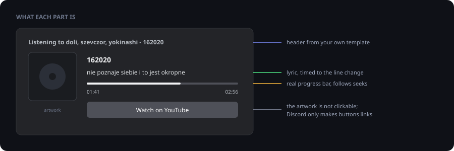
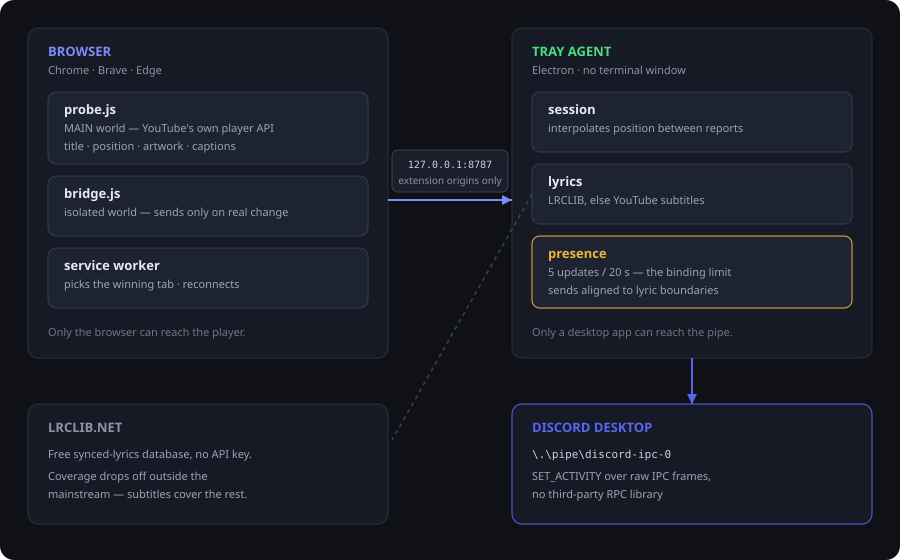
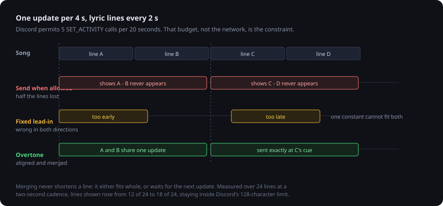

# Overtone

**Discord Rich Presence for YouTube and YouTube Music, with time-synced lyrics.**

Shows what you are watching or listening to on your Discord profile: the title,
the channel or artist, the video thumbnail as cover art, a real progress bar
with time remaining, and a button that opens the video. The current lyric line
runs alongside it.



---

## What it does

- **YouTube and YouTube Music** — video thumbnail or album art, title, channel or artist
- **A header you control** — `Listening to doli, szevczor, yokinashi - 162020`, not just `Listening to YouTube`
- **Real progress** — Discord's own bar with time remaining, following pauses and seeks
- **Lyrics from two sources** — [LRCLIB](https://lrclib.net) when it has the song, YouTube's own subtitle track when it does not, including auto-generated and auto-translated tracks
- **Live streams** — elapsed time instead of remaining
- **Privacy mode** — shows that you are watching something without saying what
- **Several tabs** — a playing video wins over a paused one
- Autostart, tray menu, log window

---

## How it works

Overtone is two pieces, and that is forced rather than chosen:



Discord's RPC runs over a local named pipe (`\\.\pipe\discord-ipc-0`). A browser
extension cannot open one. A desktop app, in turn, cannot see inside a YouTube
tab. So the extension reads the player, the agent talks to Discord, and a
WebSocket on `127.0.0.1:8787` sits between them.

That socket is reachable from any page you visit, so the agent checks the
`Origin` header and accepts extension origins only; `http(s)://` gets a 403.

Playback data comes from YouTube's own player API through a content script in
the **MAIN world**, not from scraping the DOM — `getVideoData()` returns the
video id, title and author directly, and survives layout changes.

---

## Lyrics, and why timing is the hard part

Discord allows **5 presence updates per 20 seconds**. Lyric lines change every
two to five. That budget, not the network, is what makes this difficult.



Two things follow from it.

**Sends are aligned to line boundaries.** Sending as soon as the rate limiter
opens makes the visible lag depend on where the line change happens to fall
inside the window — so a fixed lead-in is too early in one case and too late in
the other. Because LRCLIB provides the whole timeline up front, the scheduler
knows when the next line starts and waits for it whenever waiting costs less
than sending text that is already stale.

**Short lines share an update.** At a two-second cadence half the lines would
never appear at all. When consecutive lines fit together inside Discord's
128-character limit, one update carries both. Nothing is ever shortened: a line
either fits whole or waits for the next update. Merging also stops at a blank
LRC cue, since that marks deliberate silence.

Subtitles get neither treatment, because the next line is unknown until YouTube
renders it. They are read straight from the player as it displays them, which
is why they need no synchronisation of their own.

---

## Install

### 1. Create a Discord application

1. [Discord Developer Portal](https://discord.com/developers/applications) → **New Application**
2. Copy the **Application ID**

### 2. Install the agent

Take the installer from the [latest release](../../releases/latest):

| File | What it does |
|---|---|
| `Overtone.Setup.x.y.z.exe` | Installs with start-menu and desktop shortcuts |
| `Overtone-x.y.z-portable.exe` | Runs without installing |

The settings window opens on first start. Paste the Application ID and you are
done; Overtone then lives in the tray.

> Windows SmartScreen warns on first run because the binary is not commercially
> signed. **More info → Run anyway.** A certificate costs money annually and
> changes nothing about the program.

From source instead: `npm install && npm start`.

### 3. Load the extension

1. Open `chrome://extensions` (or `brave://extensions`)
2. Enable **Developer mode**
3. **Load unpacked** → select the `extension/` folder

> After updating the extension files, click **↻** *and reload open YouTube
> tabs*. Unpacked extensions never reload themselves, and content scripts are
> not injected into tabs that are already open. The agent warns when the
> extension it is talking to is out of date.

### 4. Check one Discord setting

**User Settings → Activity Privacy → "Display current activity as a status
message"** has to be on.

---

## The activity header

The header is a prefix plus a name:

| `activityType` | Prefix |
|---|---|
| `auto` | video → `Watching …`, music → `Listening to …` |
| `listening` | `Listening to …` |
| `watching` | `Watching …` |
| `playing` | `Playing …` |

Discord normally fills the name with your application's name, which is why it
would read the same for every song. RPC does accept an explicit name and the
desktop client renders it, so `activityName` is a template for it:

```
{artist} - {title}    ->    Listening to doli, szevczor, yokinashi - 162020
```

Placeholders: `{artist}`, `{title}`, `{channel}`. Multiple artists are
normalised to the comma form Spotify uses — `doli x szevczor x yokinashi`
becomes `doli, szevczor, yokinashi`. Leave the template empty to fall back to
the application name. It is skipped in privacy mode, so the header cannot give
away what the rest of the presence is hiding.

---

## What it cannot do

- **The cover art is not clickable.** Discord never turns the large image into a
  link; only buttons are links. Hence the button underneath.
- **It does not touch your custom status.** The status field on your profile can
  only be set with your user token — self-botting, against Discord's terms, and
  the token grants full access to the account. Overtone does not go near it. The
  closest legitimate equivalent is **"lyric on the first line"**, which puts the
  lyric in bold at the top and moves the title below it.
- **You may not see the buttons on your own profile.** Discord sometimes hides
  them in your own preview. Other people see them.
- **Lyrics can lag.** With LRCLIB the scheduler keeps the error under about
  0.6 s on average and never sends early. Subtitles have no lookahead, so up to
  roughly 4 s.
- **Subtitles must be switched on in the player.** Overtone reads what YouTube
  actually displays; with subtitles off there is nothing to read.

---

## Configuration

Everything is reachable from the settings window or the tray menu. The file
lives at `%APPDATA%\Overtone\config.json`.

| Setting | Default | Meaning |
|---|---|---|
| `clientId` | – | Discord Application ID |
| `port` | `8787` | Bridge port; must match the extension |
| `activityType` | `auto` | Header prefix |
| `activityName` | `{artist} - {title}` | Header name; empty = application name |
| `showTimestamps` | `true` | Progress bar |
| `showButton` | `true` | Button to the video |
| `privacyMode` | `false` | Hide title and artwork |
| `lyricsEnabled` | `true` | Lyric line in the presence |
| `lyricsSource` | `auto` | `auto`, `lrclib`, `captions` |
| `lyricsMusicOnly` | `false` | Lyrics only on YouTube Music |
| `lyricsProminent` | `false` | Lyric on the first, bold line |
| `lyricsCombine` | `1` | Merge strength: `0` off, `1`, `1.5`, `2` |
| `lyricsOffset` | `0` | Manual trim in seconds; only for skewed LRC files |
| `highResArtwork` | `true` | `maxresdefault` instead of `hqdefault` |

---

## Development

```bash
npm install                # also generates the icons
npm start                  # run the agent from source
npm test                   # unit tests
npm run test:integration   # hits the live LRCLIB API
npm run build              # installer + portable exe into dist/
```

The build config lives in `agent/electron-builder.config.js` rather than in
`package.json`, because npm workspaces hoist `electron` into the root
`node_modules` where electron-builder cannot find its version.

Architecture notes: [`docs/ARCHITECTURE.md`](docs/ARCHITECTURE.md).
Bridge protocol: [`docs/PROTOCOL.md`](docs/PROTOCOL.md).

---

## License

MIT — see [`LICENSE`](LICENSE).

Not affiliated with Discord, YouTube or Google.

*[Deutsche Fassung](README.de.md)*
